#
# Feature engineering 

Feature engineering is the process of using domain knowledge to extract features (characteristics, properties, or attributes) from raw data that make machine learning algorithms work better. It involves transforming raw data into a format that makes it easier for predictive models to understand and interpret.
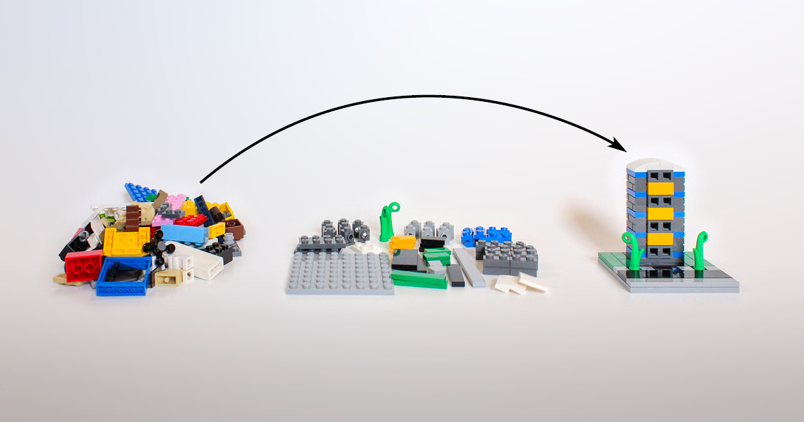

<u><b>Gains of using Feature engineering in Data Science</b></u>

### 1. **Improving Model Accuracy**

- **Problem**: Raw data often contains irrelevant or redundant information, which can hinder a model's performance.
- **Solution**: Feature engineering helps in transforming and selecting relevant features, thus improving the model's ability to learn from the data.
- **Example**: In predicting house prices, instead of using raw addresses, you can engineer features like proximity to schools, neighborhood crime rates, and average income levels in the area, which are more predictive.

### 2. **Handling Missing Data**

- **Problem**: Missing data can skew analysis and degrade model performance.
- **Solution**: Feature engineering includes techniques for imputing missing values, such as filling them with the mean, median, mode, or using more complex algorithms to estimate them.
- **Example**: In a dataset of customer information, missing age values can be imputed with the median age of the existing data to prevent gaps.

### 3. **Managing Categorical Data**

- **Problem**: Machine learning algorithms typically require numerical input, but real-world data often includes categorical variables.
- **Solution**: Feature engineering includes techniques like one-hot encoding, label encoding, or embedding methods to convert categorical data into a numerical format.
- **Example**: Converting a "color" column with values like "red", "green", and "blue" into binary columns or numerical codes that a machine learning algorithm can process.

### 4. **Dealing with Non-Linear Relationships**

- **Problem**: Linear models may fail to capture non-linear relationships in the data.
- **Solution**: Feature engineering can create polynomial features or interaction terms that help models capture these non-linear relationships.
- **Example**: For a model predicting car prices, creating an interaction feature between engine size and fuel efficiency might better capture the complex relationship affecting the price.
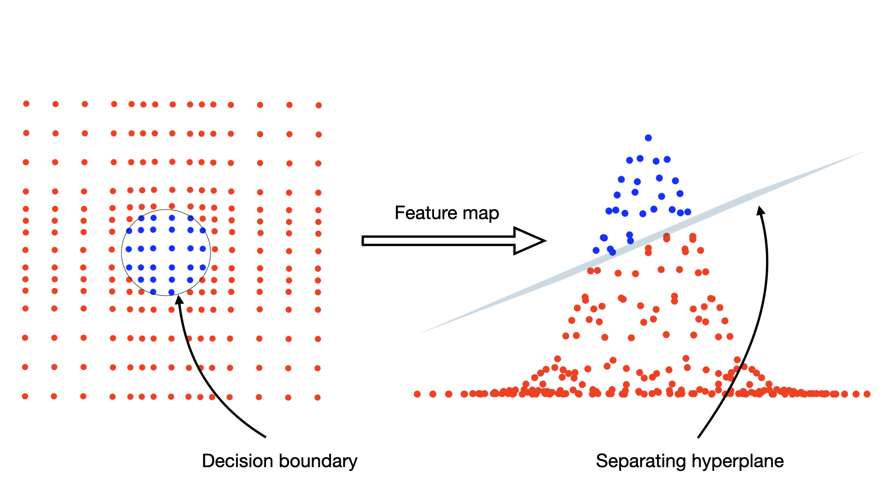

### 5. **Reducing Dimensionality**

- **Problem**: High-dimensional data can lead to overfitting and increased computational complexity.
- **Solution**: Feature engineering techniques like Principal Component Analysis (PCA) or selecting a subset of important features can reduce dimensionality.
- **Example**: In text analysis, using techniques like TF-IDF and then applying PCA to reduce the number of features while retaining most of the information.
  
   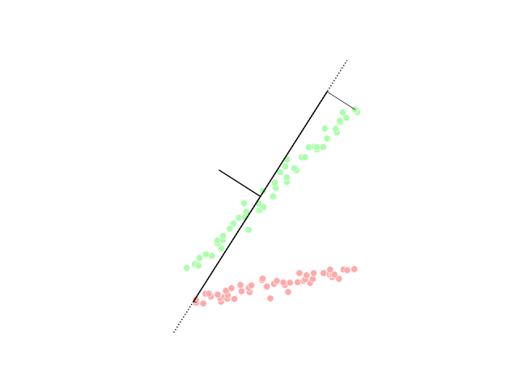

### 6. **Enhancing Interpretability**

- **Problem**: Complex models can be difficult to interpret and understand.
- **Solution**: Feature engineering can create more meaningful and interpretable features that make the model's decisions easier to understand.
- **Example**: Instead of using raw pixel values in an image classification task, engineered features like edges, textures, and shapes make the model's decision process more interpretable.

### 7. **Addressing Data Distribution and Scale Issues**

- **Problem**: Features with different scales or non-normal distributions can negatively impact model performance.
- **Solution**: Techniques such as normalization, standardization, and transformation (e.g., log transformation) can be applied to ensure features are on similar scales and have desirable distributions.
- **Example**: In financial data, log-transforming income can handle skewness and make the data more normally distributed.
- 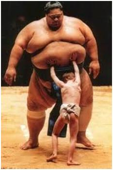

### 8. **Creating New Features from Existing Data**

- **Problem**: Raw data may not contain all the information needed to make accurate predictions.
- **Solution**: Feature engineering can derive new features from existing data to provide more context to the model.
- **Example**: In time-series analysis, creating lag features (e.g., previous day’s sales) and rolling statistics (e.g., 7-day moving average) can help capture trends and seasonality.

### 9. **Improving Model Robustness**

- **Problem**: Models can be sensitive to outliers or irrelevant data points.
- **Solution**: Feature engineering can involve techniques to handle outliers, such as capping or transformation, and ensuring that the features used are robust to noise.
- **Example**: In a dataset with income values, capping extreme outliers at a certain threshold can prevent them from disproportionately influencing the model.

### 10. **Enhancing Model Training Speed by Feature Selection**

- **Problem**: Large datasets with many features can slow down model training.
- **Solution**: By selecting and engineering only the most relevant features, the dimensionality of the data can be reduced, speeding up the training process.
- **Example**: Using feature selection techniques to identify and retain only those features that have the highest correlation with the target variable.

#
# A cooking Analogy

[`Data scientist`] You are a chef preparing a dish for a cooking competition. .<br>
[`Data`] You use raw ingredients to prepare the dish. <br>
[`Feature Engineering`] Process of preparing the ingeredient for the dish <br>
[`Modelling`] Cooking process <br>
[`Cross Validation`] Tasting and adjusting  

1. **Selecting Ingredients** (`Selecting Features`): Just as you wouldn't use every available ingredient in your dish, you also don't need every piece of raw data for your model. You select only those ingredients that will enhance the flavor and presentation of your dish. Example: for Paneer Sandwich, you may not need mangos and brinjal, adding these ingerediants to your food will only spoil the taste <br> <br> 
<u>In feature engineering</u>, you select only the most relevant features from the data lake that will contribute in achieveing the model objective.


1. **Chopping and Marinating** (`Transforming Features`): Before cooking, you might chop vegetables, marinate meat, or blend spices. These steps enhance the flavors and textures of your dish. <br> <br> 
<u>In feature engineering</u> you might normalize, massage, scale, your data to make it more suitable for your model. For example, if you have a date-time field, you might extract the hour, day, month, or even whether it's a weekend or holiday, depending on what might be relevant to your model objective.

   

1. **Combining Ingredients** (`Creating New Features`): Sometimes, the combination of ingredients creates a unique flavor that individual ingredients alone cannot achieve. Example, rosting dry grapes in Ghee. <br> <br> 
<u>In Feature Engineering</u> you can create new features from existing ones. For example, combining latitude and longitude coordinates might create a "region" feature that's more useful for your model.


1. **Tasting and Adjusting** (`Evaluating Features`): Chefs taste their dish as they cook, adjusting seasoning as needed. </u> Example add salt, chillie to finetune the final taste. <br> <br> 
<u>In feature engineering</u> you evaluate how well your features improve model performance, making adjustments based on cross-validation results or feature importance scores.


#
# Data Science Example 
Predicting house prices:

- **Raw Data**:  

| address | date of sale | number of rooms | square footage | year built |
| ------- | ------------ | --------------- | -------------- | ---------- |
<br>

- **Feature Engineering**:
  - Extracting the year and month from the date of sale to identify seasonal trends.
  - Calculating the age of the house from the year built.
  - Creating a feature for the proximity to schools or public transport from the address.
  - Normalizing the square footage to handle variations in data scale.

By transforming raw data through these steps, your model can better understand the factors that influence house prices, leading to more accurate predictions.

# 
# Various Techniques for Feature Engineering
## Tabular Data 

1. **Scaling and Transformation Techniques** <br>
   <!-- `Scaling` - Distribution is maintained <br>
   `Transform` - Distribution is changed -->
   - **Scaling**: 
     - **Min-Max Scaling**: Rescales features to a fixed range, typically [0, 1]. Useful in algorithms that are sensitive to feature scales like k-nearest neighbors and neural networks.
         ``` python 
         from sklearn.preprocessing import MinMaxScaler

         scaler = MinMaxScaler()
         scaler.fit(X)
         X_scaled = scaler.transform(X)
         ```
     - **Standard Scaling**: Standardizes features by removing the mean and scaling to unit variance. Commonly used in algorithms like SVM and linear regression.
         ``` python 
         from sklearn.preprocessing import StandardScaler

         scaler = StandardScaler()
         scaler.fit(X)
         X_scaled = scaler.transform(X) 
         ```
     - **Robust Scaling**: Scales features using statistics that are robust to outliers, such as the median and interquartile range. Useful when data contains outliers. Subtract all the data points with the median value and then divide it by the Inter Quartile Range(IQR)

         ``` python
         from sklearn.preprocessing import RobustScaler

         scaler = RobustScaler()
         scaler.fit(X)
         X_scaled = scaler.transform(X)
         ```

   - **Log Transformation**: Applies the natural logarithm to data, which can help to stabilize variance and make the data more Gaussian-like. Useful for skewed data.
     - Considerations, no Zero or Negative data when log transform. 
     - All log transforms are reversable.
    
         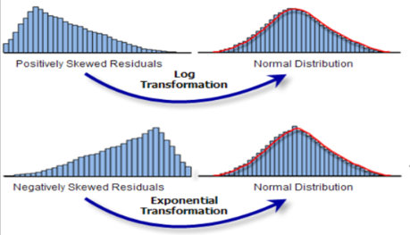
   - **Square Root Transformation**: Similar to log transformation, reduces skewness and stabilizes variance. Its effect is mild and not strong as Log or Power Transform. 
   - **Exponential Transformation**: Applies the exponential function, often used to transform normally distributed data to a skewed distribution.
   - **Box-Cox Transformation**: A power transform to stabilize variance and make data more Gaussian-like.
   - **Yeo-Johnson Transformation**: Similar to Box-Cox but can handle zero and negative values.

2. **Encoding Techniques**
   - **One-Hot Encoding**: Converts categorical variables into a series of binary columns. Useful for algorithms that cannot handle categorical variables natively, like linear regression.
   - **Label Encoding**: Assigns a unique integer to each category. Useful for ordinal data or when using tree-based models.
   - **Binary Encoding**: Converts categories to binary code and splits the digits into separate columns. Efficient for high cardinality features.
   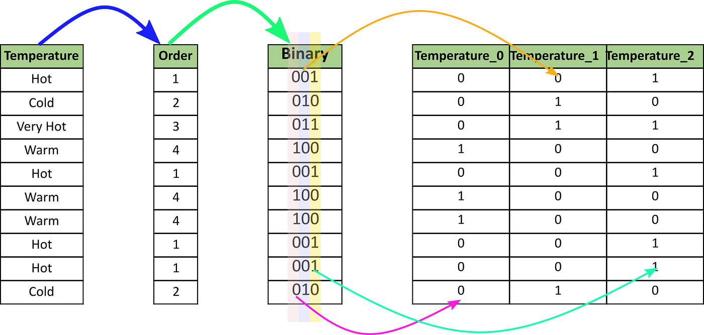
   - **Ordinal Encoding**: Encodes categories with integers preserving order. Used for ordinal data.
   - **Frequency Encoding**: Replaces categories with their frequency count. Useful for tree-based models.  Example: Word count representation. Increases the dimension exponentially
   - **Target Encoding**: Replaces categories with the mean of the target variable for each category. Useful for reducing dimensionality while keeping predictive power without adding extra columns. The approach to calculating the expected value depends on the value being predicted. Risk of target leak
   
      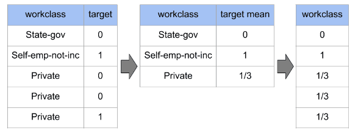
  <!-- **Mean Encoding**: Similar to target encoding, replaces categories with the mean target value, useful for categorical features with a large number of categories -->

3. **Polynomial and Interaction Features**
   - **Polynomial Features**: Generates new features by taking polynomial combinations of existing features. Useful for capturing non-linear relationships.
   - **Interaction Features**: Multiplies features together to capture interactions between them. Enhances models that can benefit from interaction terms, like linear regression. Example: Multiplying 2 features to produce a new feature, `length x width = area`
   - **Splines**: Piecewise polynomial functions that can model non-linear relationships. Used in regression and smoothing tasks.

4. **Binning and Discretization**
   - **Equal Width Binning**: Divides the range of a feature into equal-width bins. Useful for converting continuous variables into categorical ones. Useful for convering Regression problem to a classification problem.
   - **Equal Frequency Binning**: Divides the data into bins with equal frequencies. Helps to manage skewed data.
   - **K-means Binning**: Uses k-means clustering to bin data. Useful for capturing complex patterns.
   <!-- - **Decision Tree Binning**: Uses decision trees to bin continuous variables. Captures interactions and non-linear relationships. -->

5. **Aggregations and Statistical Summaries**
   - **Group Aggregations**: Aggregates data by groups (mean, sum, count). Useful for creating features in time-series and categorical data.
   - **Rolling Statistics**: Computes statistics over a rolling window (mean, sum). Used in time-series analysis.
   - **Cumulative Statistics**: Computes cumulative sum, mean, etc. Useful for sequential data. Useful for calculating lift and gains chart.

6. **Missing Value Imputation**
   - **Mean/Median/Mode Imputation**: Replaces missing values with the mean, median, or mode. Simple and quick for numerical and categorical data.
   - **K-Nearest Neighbors Imputation**: Imputes missing values based on the nearest neighbors. Effective for small datasets.
   <!-- - **Iterative Imputation**: Imputes missing values by modeling each feature with missing values as a function of other features. Useful for datasets with many missing values. Using Machine learning model to impute the missing data -->
   - **Interpolation**: Estimates missing values within the range of a dataset. Used for time-series data.
   
      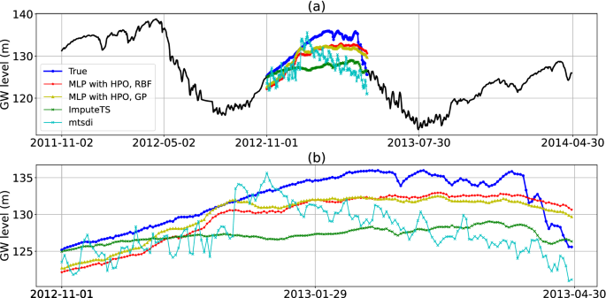 

7. **Feature Extraction**
   - **Principal Component Analysis (PCA)**: Reduces dimensionality by transforming features into a set of orthogonal components. Used for noise reduction and visualization.

      
   - **Independent Component Analysis (ICA)**: Similar to PCA but assumes statistical independence. Used in signal processing. 
   <!-- - **Factor Analysis**: Identifies underlying relationships between variables. Used in psychometrics and market research. -->
   - **t-Distributed Stochastic Neighbor Embedding (t-SNE)**: Non-linear dimensionality reduction for visualization. Used for high-dimensional data.
   - **Uniform Manifold Approximation and Projection (UMAP)**: Non-linear dimensionality reduction, faster than t-SNE. Used for clustering and visualization.
   - **Linear Discriminant Analysis (LDA)**: Reduces dimensionality by finding linear combinations that best separate classes. Used in classification tasks.

   | Technique | Type         | Main Purpose          | Strengths                                                   | Weaknesses                                                                 | Best Use Cases                                      |
   | --------- | ------------ | --------------------- | ----------------------------------------------------------- | -------------------------------------------------------------------------- | --------------------------------------------------- |
   | PCA       | Unsupervised | Variance maximization | Linear, easy to interpret, computationally efficient        | Assumes linear relationships                                               | Dimensionality reduction, noise reduction           |
   | ICA       | Unsupervised | Feature extraction    | Effective for non-Gaussian data, source separation          | Computationally intensive                                                  | Signal processing, feature extraction               |
   | t-SNE     | Unsupervised | Visualization         | Captures complex structures, effective for visualization    | Computationally expensive, sensitive to hyperparameters, non-deterministic | Visualizing clusters and structures                 |
   | UMAP      | Unsupervised | Manifold learning     | Captures local/global structures, computationally efficient | Sensitive to parameters                                                    | Visualization, preprocessing                        |
   | LDA       | Supervised   | Class separability    | Uses class labels, good for linearly separable classes      | Assumes normal distribution, linear boundaries                             | Classification, supervised dimensionality reduction |


8. **Feature Selection**
   - **Univariate Selection**: Selects features based on statistical tests (ANOVA, Chi-square). Useful for initial feature selection.
   - **Recursive Feature Elimination (RFE)**: Iteratively removes the least important features. Used in combination with a model.
   - **L1 Regularization (Lasso)**: Selects features by adding a penalty to the model. Useful for sparse solutions.
   - **L2 Regularization (Ridge)**: Selects features by adding a penalty to the model. useful in feature engineering for handling multicollinearity and improving model generalization.
   - **Tree-based Methods**: Uses feature importance scores from tree-based models (Random Forest, XGBoost). Effective for non-linear and high-dimensional data.

9.  **Time Series Specific Techniques**
    - **Lag Features**: Creates features based on previous time steps. Used in forecasting.
    - **Rolling Window Statistics**: Computes statistics over rolling windows. Used in financial analysis.
    - **Seasonal Decomposition**: Decomposes time series into trend, seasonal, and residual components. Used in time-series analysis.
    - **Date/Time Features**: Extracts features from date/time (day, month, year, weekday). Used for time-related patterns.
    - **Fourier Transforms**: Transforms time series data into frequency domain. Used for signal processing.

## Image Data Feature Engineering Techniques

1. **Color Space Transformation**
   - **RGB to Grayscale**: Converts RGB images to grayscale. Simplifies image data and reduces dimensionality.
   - **RGB to HSV/YCbCr/YUV**: Transforms color spaces to better separate color information. Used in image processing tasks.

2. **Normalization and Standardization**
   - **Pixel Value Scaling**: Scales pixel values to a fixed range. Used to normalize image data.
   - **Z-score Normalization**: Standardizes pixel values to have zero mean and unit variance. Used for consistent illumination conditions.

3. **Filtering and Edge Detection**
   - **Gaussian Blur**: Applies a Gaussian filter to smooth images. Reduces noise.
   
       
   - **Sobel Filters**: Detects edges by computing gradients. Used in edge detection.
  
       
   - **Canny Edge Detection**: Detects edges using multi-stage algorithm. Provides robust edge detection.
  
      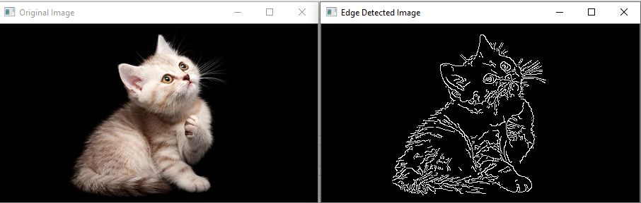 

4. **Feature Extraction**
   - **Histogram of Oriented Gradients (HOG)**: Describes image shapes by gradient orientation histograms. Used in object detection.
      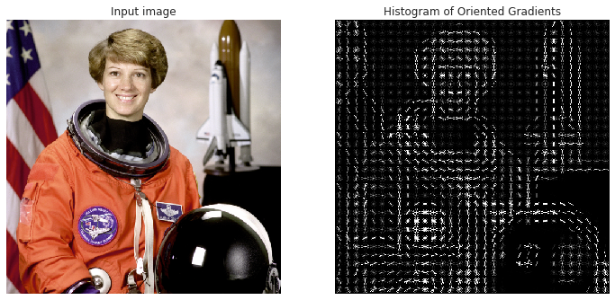 

   - **SIFT (Scale-Invariant Feature Transform)**: Detects and describes local features in images. Used in image matching and object recognition.
  
   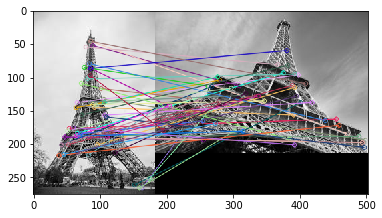 
   - **SURF (Speeded-Up Robust Features)**: Similar to SIFT but faster. Used for real-time applications.
   - **ORB (Oriented FAST and Rotated BRIEF)**: Efficient alternative to SIFT and SURF. Used in feature matching.
   - **LBP (Local Binary Patterns)**: Captures texture information by comparing pixel intensities. Used in texture classification.
  
      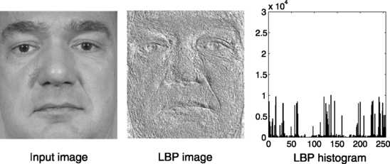 

5. **Dimensionality Reduction**
   - **PCA on Flattened Images**: Applies PCA to reduce image dimensionality. Used for noise reduction and compression.
   - **Autoencoders**: Neural networks that learn efficient codings of images. Used for unsupervised feature learning.

6. **Augmentation Techniques**
   - **Rotation**: Rotates images randomly. Enhances model robustness.
   - **Scaling**: Scales images randomly. Helps in learning scale-invariant features.
   - **Translation**: Shifts images randomly. Captures positional variance.
   - **Flipping**: Flips images horizontally or vertically. Increases dataset diversity.
   - **Cropping**: Crops random portions of images. Focuses on different parts.
   - **Color Jittering**: Randomly changes brightness, contrast, saturation. Enhances robustness to lighting variations.

      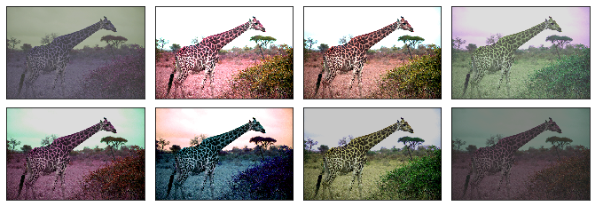 
   - **Random Erasing**: Randomly erases portions of images. Acts as a form of regularization.

## Text Data Feature Engineering Techniques

1. **Text Normalization**
   - **Lowercasing**: Converts all text to lowercase. Ensures uniformity.
   - **Removing Punctuation**: Removes punctuation marks. Reduces noise.
   - **Removing Stop Words**: Removes common but unimportant words. Focuses on meaningful words.
   - **Stemming**: Reduces words to their root form. Simplifies variations.
   - **Lemmatization**: Converts words to their base form. More accurate than stemming.

2. **Tokenization**
   - **Word Tokenization**: Splits text into words. Fundamental for text analysis.
   - **Character Tokenization**: Splits text into characters. Used in language modeling.
   - **Sentence Tokenization**: Splits text into sentences. Used in document parsing.
   - **Ngrams**: Creates contiguous sequences of n items. Captures context and phrases.

3. **Encoding Techniques**
   - **Bag of Words (BoW)**: Represents text by word frequency. Simple and effective for many tasks.
   - **TF-IDF (Term Frequency-Inverse Document Frequency)**: Weighs terms by importance. Reduces influence of common words.
   - **Word Embeddings**: Embeds words into continuous vector space (Word2Vec, GloVe, FastText). Captures semantic meaning.
   - **Document Embeddings**: Embeds entire documents into vector space (Doc2Vec). Captures document-level semantics.
   - **Contextual Embeddings**: Uses models like BERT, ELMo, GPT to embed words in context. Captures nuanced meanings.

4. **Feature Extraction**
   - **Part-of-Speech (POS) Tagging**: Tags words with their parts of speech. Useful for syntactic parsing.
   - **Named Entity Recognition (NER)**: Identifies named entities in text. Useful for information extraction.
   - **Dependency Parsing**: Analyzes grammatical structure. Useful for understanding relationships.
   - **Sentiment Analysis Scores**: Scores text for sentiment. Used in opinion mining.
   - **Topic Modeling**: Extracts topics from text (LDA, NMF). Used for topic discovery.

5. **Dimensionality Reduction**
   - **Latent Semantic Analysis (LSA)**: Reduces dimensionality using singular value decomposition. Captures underlying concepts.
   - **PCA on Embeddings**: Applies PCA to word/document embeddings. Reduces noise and redundancy.

6. **Text Augmentation**
   - **Synonym Replacement**: Replaces words with synonyms. Increases text diversity.
   - **Back Translation**: Translates text to another language and back. Generates paraphrases.
   - **Random Insertion/Deletion/Substitution**: Randomly inserts, deletes, or substitutes words. Regularizes models.
  

# Feature Engineering Framworks

In Python, several frameworks and libraries are available to help with feature engineering. These tools provide a variety of functions and utilities to make the process easier, more efficient, and more effective. Here are some of the most popular frameworks and libraries for feature engineering in Python:

### 1. **Pandas**
- **Description**: Pandas is a powerful and flexible data manipulation library that provides data structures like DataFrames, which are ideal for data analysis and feature engineering.
- **Key Features**: Data cleaning, transformation, aggregation, merging, and filtering.
- **Example**:
  ```python
  import pandas as pd

  df = pd.read_csv('data.csv')
  df['year'] = pd.to_datetime(df['date']).dt.year
  df['month'] = pd.to_datetime(df['date']).dt.month
  df['house_age'] = 2024 - df['year_built']
  ```

### 2. **NumPy**
- **Description**: NumPy is a fundamental library for numerical computing in Python. It provides support for arrays and matrices, along with a collection of mathematical functions to operate on these data structures.
- **Key Features**: Efficient array operations, mathematical and statistical functions.
- **Example**:
  ```python
  import numpy as np

  data = np.array([1, 2, 3, 4, 5])
  normalized_data = (data - np.mean(data)) / np.std(data)
  ```

### 3. **Scikit-learn**
- **Description**: Scikit-learn is a comprehensive machine learning library that includes tools for data preprocessing, model selection, and evaluation.
- **Key Features**: Imputation, scaling, encoding categorical variables, generating polynomial features.
- **Example**:
  ```python
  from sklearn.preprocessing import StandardScaler, OneHotEncoder
  from sklearn.impute import SimpleImputer
  from sklearn.pipeline import Pipeline
  from sklearn.compose import ColumnTransformer

  numeric_features = ['age', 'income']
  categorical_features = ['gender', 'occupation']

  numeric_transformer = Pipeline(steps=[
      ('imputer', SimpleImputer(strategy='median')),
      ('scaler', StandardScaler())
  ])

  categorical_transformer = Pipeline(steps=[
      ('imputer', SimpleImputer(strategy='most_frequent')),
      ('onehot', OneHotEncoder(handle_unknown='ignore'))
  ])

  preprocessor = ColumnTransformer(
      transformers=[
          ('num', numeric_transformer, numeric_features),
          ('cat', categorical_transformer, categorical_features)
      ])

  X = preprocessor.fit_transform(df)
  ```

<!-- ### 4. **Feature-engine**
- **Description**: Feature-engine is a Python library designed specifically for feature engineering. It provides a variety of transformers to create, transform, and select features.
- **Key Features**: Handling missing data, encoding categorical variables, discretization, variable transformation, outlier detection, feature selection.
- **Example**:
  ```python
  from feature_engine.imputation import MeanMedianImputer
  from feature_engine.encoding import OneHotEncoder

  imputer = MeanMedianImputer(imputation_method='median', variables=['age'])
  encoder = OneHotEncoder(variables=['gender'])

  df = imputer.fit_transform(df)
  df = encoder.fit_transform(df)
  ``` -->

<!-- ### 5. **TensorFlow and Keras**
- **Description**: TensorFlow and Keras are libraries for deep learning, but they also include modules for preprocessing data, which is crucial for feature engineering in neural networks.
- **Key Features**: Normalization, categorical encoding, image preprocessing, text vectorization.
- **Example**:
  ```python
  import tensorflow as tf

  normalizer = tf.keras.layers.Normalization()
  normalizer.adapt(data)

  normalized_data = normalizer(data)
  ``` -->

<!-- ### 6. **PyCaret**
- **Description**: PyCaret is an open-source, low-code machine learning library that automates the process of feature engineering and model training.
- **Key Features**: Automatic handling of missing data, encoding, scaling, and transformation.
- **Example**:
  ```python
  from pycaret.classification import setup, compare_models

  clf = setup(data=df, target='target_column')
  best_model = compare_models()
  ```

### 7. **Dask**
- **Description**: Dask is a parallel computing library that scales Python code for handling large datasets. It integrates well with Pandas for data manipulation.
- **Key Features**: Parallelized and distributed operations, integration with Pandas and NumPy.
- **Example**:
  ```python
  import dask.dataframe as dd

  ddf = dd.read_csv('large_data.csv')
  ddf['year'] = dd.to_datetime(ddf['date']).dt.year
  ddf['month'] = dd.to_datetime(ddf['date']).dt.month
  ```

### 8. **FeatureTools**
- **Description**: FeatureTools is a library for automated feature engineering, particularly useful for relational and temporal datasets.
- **Key Features**: Deep feature synthesis, transforming raw data into meaningful features.
- **Example**:
  ```python
  import featuretools as ft

  es = ft.EntitySet(id="customer_data")
  es = es.entity_from_dataframe(entity_id="transactions", dataframe=df, index="transaction_id")
  feature_matrix, feature_defs = ft.dfs(entityset=es, target_entity="transactions")
  ```

Each of these frameworks and libraries has its strengths, and the choice of which to use often depends on the specific requirements of your project, such as the size of the data, the complexity of the features, and the type of model you plan to use. -->